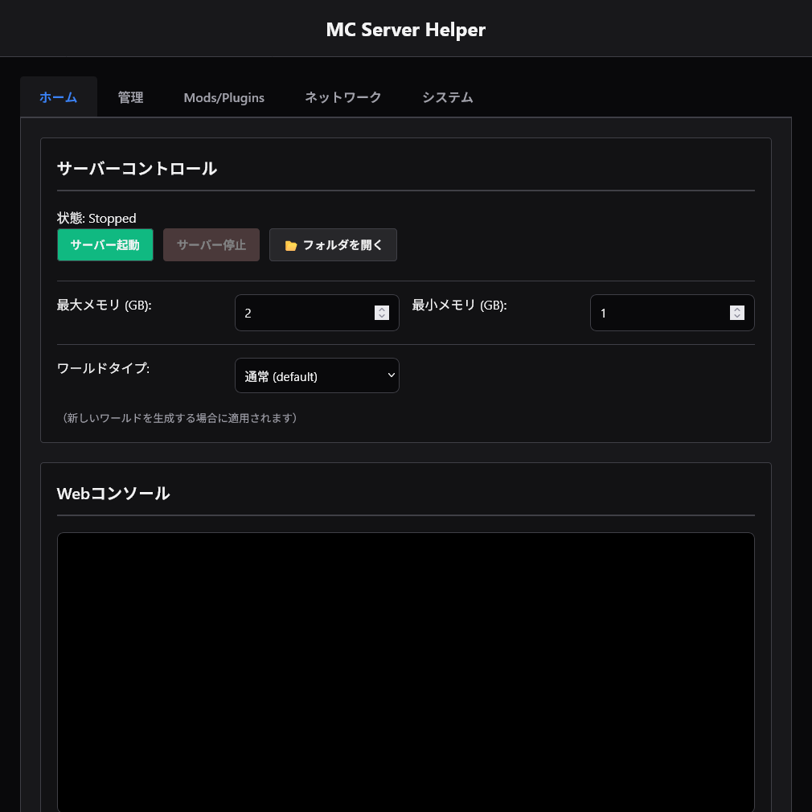

# McServerHelper

Minecraftサーバーの構築・管理をWebブラウザから直感的に行うための多機能管理ツールです。
「黒い画面（コマンドプロンプト）での操作が苦手」「ポート開放が難しくてできない」「Modやプラグインの管理が面倒」といったサーバー運営の悩みを解決します。



## ✨ 主な機能

### 1. サーバー管理の簡略化
*   **カンタン起動・停止**: Webブラウザ上のボタンひとつでサーバーをコントロール可能。
*   **メモリ設定**: サーバーに割り当てるメモリ量（Xmx/Xms）をUIから設定できます。batファイルを書き換える必要はありません。
*   **Webコンソール**: サーバーのログをリアルタイムにブラウザへ表示。コマンド入力欄から `/op` や `/gamemode` などのコマンドを直接サーバーに送信できます。
*   **クイックコマンド**: 時間変更、天気の変更、プレイヤーのKick/Banなど、よく使うコマンドをボタン化し、ワンクリックで実行できます。

### 2. サーバーソフトウェアの自動ダウンロード
以下のサーバーソフトウェアに対応しており、バージョンとビルドを指定して直接ダウンロード・インストールできます。公式サイトを探し回る必要はありません。
*   **Vanilla** (Minecraft公式サーバー)
*   **Paper** (高性能・軽量化プラグインサーバー)
*   **Purpur** (Paper派生の多機能サーバー)
*   **Fabric** (軽量Modローダー)
*   **NeoForge** (新しいForge派生Modローダー)
*   **Forge** (もっとも歴史のあるModローダー)
*   **Mohist** (Forge ModとBukkitプラグインを併用可能なサーバー)

### 3. Mod & プラグイン管理 (Modrinth連携)
人気Mod配布プラットフォーム **Modrinth** とAPI連携し、以下の機能を提供します。
*   **検索 & インストール**: ツール内でModやプラグインをキーワード検索し、MinecraftのバージョンやMod Loader（Fabric/Forge等）でフィルタリングして直接導入できます。
*   **更新チェック**: インストール済みのModに新しいバージョンがリリースされているか確認し、リストアップします。
*   **ファイル管理**: ローカルにある `.jar` ファイルをドラッグ＆ドロップでアップロードしたり、不要になったModをブラウザ上から削除したりできます。

### 4. サーバー設定 (server.properties) エディタ
初心者にはわかりにくい `server.properties` ファイルを、日本語の解説付きで編集できる専用エディタを搭載しています。
「難易度」「ゲームモード」「PVPの許可設定」などを、フォームに入力する感覚で安全に変更できます。

### 5. バックアップと復元
*   **ワンクリックバックアップ**: ワールドデータをZIP形式で圧縮し、タイムスタンプ付きで保存します。
*   **簡単復元**: 作成したバックアップリストから、いつでも過去の状態に巻き戻すことができます。

### 6. ポート開放不要の公開機能 (Ownserver)
[ownserver](https://github.com/Kumassy/ownserver) クライアントを内蔵しています。
*   **マルチプレイ公開**: 自宅のルーター設定（ポート開放）を一切触ることなく、サーバーをインターネットに公開し、友人を招待できます。
*   **Web UIのリモートアクセス**: 管理画面自体も一時的に外部公開できるため、外出先からスマホでサーバーの再起動やコンソールの確認が行えます。

---

## 🚀 使い方

### 必要なもの
*   **Java**: Minecraftサーバーを動かすために必要です。プレイしたいMinecraftのバージョンに対応したJava（1.18以降ならJava 17、1.20.5以降ならJava 21など）をPCにインストールしてください。
*   このツール (`MCServerHelper.exe`)

### 1. 導入と起動
1.  **配置**: ダウンロードした `MCServerHelper.exe` を、サーバーを作りたい空のフォルダ（または既存のサーバーがあるフォルダ）に入れます。
2.  **起動**: `MCServerHelper.exe` をダブルクリックして起動します。
    *   初回起動時、自動的に依存ファイルのチェックが行われます。
3.  **管理画面へアクセス**: 起動すると自動的にブラウザが立ち上がり、管理画面 (`http://localhost:5000`) が表示されます。

### 2. サーバーの準備（初回のみ）
まだサーバーデータがない場合は、ツールを使ってダウンロードしましょう。
1.  画面上部のタブから **「ソフトウェア」** を開きます。
2.  使いたいサーバーソフト（例: `Paper`）を選択します。
3.  遊びたいバージョン（例: `1.20.4`）とビルドを選択し、**「インストール」** ボタンを押します。
4.  自動的に `server.jar` がダウンロードされ、起動設定にパスが登録されます。

### 3. サーバーの起動
1.  **「ホーム」** タブに戻ります。
2.  必要に応じてメモリ設定（例: 4G）などを入力します。
3.  **「起動」** ボタンをクリックします。
    *   初回起動時は、自動的にEULA（利用規約）への同意ファイル(`eula.txt`)が生成されます。
4.  下の黒い画面（コンソール）にログが流れ始め、"Done!" と表示されれば起動完了です。

### 4. Mod / プラグインの導入
1.  **「Modrinth」** タブを開きます。
2.  検索ボックスにMod名（例: `Sodium`, `WorldEdit`）を入力して検索します。
3.  検索結果をクリックして詳細を開き、サーバーのバージョンに合ったファイルを選んで **インストール** ボタンを押します。
    *   ※ Modを入れる場合は、先に「ソフトウェア」タブで Fabric や Forge などのMod対応サーバーをインストールしておく必要があります。

### 5. 友達を招待する (Ownserver)
1.  ホーム画面右側のサイドバー（または下部）にある **Ownserver** パネルを確認します。
2.  **「サーバーを公開 (MC)」** ボタンを押します。
3.  少し待つと「公開アドレス」が表示されます（例: `xxxxx.ownserver.kumassy.com`）。
4.  このアドレスを友達に教えて、Minecraftの「サーバーアドレス」に入力してもらえば一緒に遊べます。

---

## ⚠️ 注意事項

*   **Javaのバージョン**: サーバーが起動しない原因の多くはJavaのバージョン不一致です。
*   **セキュリティ**: Ownserver機能で「Web UI」を公開する場合、そのURLを知っている人は誰でもサーバーの操作（停止やBANなど）ができてしまいます。信頼できる人にのみURLを教え、使用が終わったら必ず「公開停止」してください。

---

## 開発者向け情報

ソースコードから実行する場合の手順です。

### 必要要件
*   Python 3.8 以上
*   pip

### セットアップ
1.  リポジトリをクローンまたはダウンロードします。
2.  依存ライブラリをインストールします:
    ```bash
    pip install -r requirements.txt
    ```
3.  アプリケーションを実行します:
    ```bash
    python mcserverhelper.py
    ```

---

## ライセンス

本プロジェクトは **MIT ライセンス** のもとで公開されています。詳細は [LICENSE](./LICENSE) ファイルをご覧ください。

### 謝辞
本プロジェクトは、ポート開放不要化機能として以下の素晴らしいオープンソースソフトウェアを利用・同梱しています。
- **[ownserver](https://github.com/Kumassy/ownserver)** (MIT License) by Kumassy
